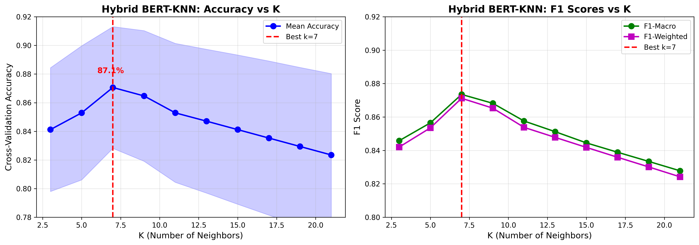
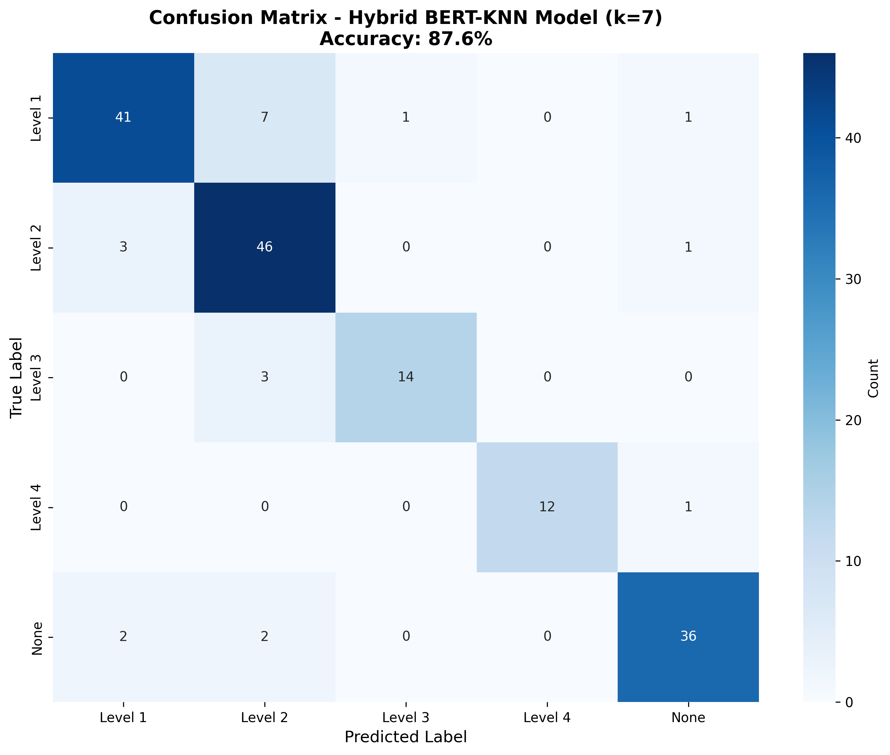

# 🏥 Automated Survey Analysis System for Mental Health Training

[](https://github.com/shouryat32/Portfolio)
[](https://www.python.org/)
[](https://github.com/shouryat32/Portfolio)

> AI-powered automated survey analysis system using the Kirkpatrick Model to transform mental health training feedback into actionable insights — reducing analysis time by 95%.

**Organization:** Phoenix Australia (Mental Health Non-Profit, University of Melbourne)  
**Duration:** March 2024 - October 2024  
**Role:** ML Engineer & Data Scientist  
**Team:** 5 Graduate Students

> **Note:** This project was developed under NDA. This portfolio showcases the technical implementation, architecture, and code without disclosing proprietary survey content, client-sensitive data, or specific participant responses.

---

## 📋 Table of Contents

- [Executive Summary](#executive-summary)
- [Problem Statement](#problem-statement)
- [Solution Overview](#solution-overview)
- [Technical Implementation](#technical-implementation)
- [Results & Impact](#results--impact)
- [Code Examples](#code-examples)
- [Technology Stack](#technology-stack)
- [Key Learnings](#key-learnings)
- [Figure References](#figure-references)

---

## 🎯 Executive Summary

Built an end-to-end automated survey analysis system that processes feedback from **190+ mental health training courses**. The system combines Google Gemini LLM, SBERT embeddings, RoBERTa sentiment analysis, and statistical testing to generate publication-quality PDF reports automatically.

### Impact at a Glance

| Metric | Before | After | Improvement |
|--------|--------|-------|-------------|
| **Analysis Time** | 2-3 hours | 5-10 min | **95% reduction** |
| **Classification** | Manual | Automated | **87-93% accuracy** |
| **Cost per Analysis** | $80-120 | <$5 | **95% reduction** |
| **Annual Capacity** | 20-30 courses | 190+ courses | **10x increase** |
| **Consistency** | Variable | 100% | **Standardized** |

**Key Achievement:** Transformed a manual, time-intensive process into a fully automated system that maintains high accuracy while dramatically reducing costs and enabling data-driven course improvements.

---

## 🔍 Problem Statement

### The Challenge

Phoenix Australia, a University of Melbourne-affiliated mental health non-profit, conducts extensive online training courses and collects feedback through Qualtrics surveys. However, the evaluation process faced critical bottlenecks:

**Manual Process Pain Points:**
- ⏰ **2-3 hours per survey** for manual analysis and classification
- 📝 **Inconsistent categorization** across different analysts
- 🔄 **Repetitive work** analyzing similar questions across 190+ courses
- 📉 **Limited statistical rigor** in reporting outcomes
- 💼 **Resource-intensive** process preventing scalability

**Business Impact:**
- Delayed insights for timely course improvement
- High operational costs for evaluation
- Inability to analyze all 190+ courses systematically
- Lack of professional, board-ready reports
- No systematic sentiment analysis of qualitative feedback

**The Requirement:** Build an automated system that could classify survey questions using the Kirkpatrick Four-Level Evaluation Model, handle diverse survey formats, maintain high accuracy, and generate professional reports for multiple stakeholder types.

---

## 🏗️ Solution Overview

### The Kirkpatrick Four-Level Evaluation Model

The system is built around the Kirkpatrick Model, which evaluates training effectiveness across four hierarchical levels:


*Figure 1: The Kirkpatrick Four-Level Evaluation Model - hierarchical framework guiding question classification (Report Page 4, Figure 2.1)*

- **Level 1 (Reaction):** Participant satisfaction, engagement, and perceived relevance
- **Level 2 (Learning):** Knowledge and skills acquired through training
- **Level 3 (Behavior):** Application of learning to workplace practice
- **Level 4 (Results):** Measurable organizational impact and outcomes

This framework guides the entire classification system and structures all analytical outputs, ensuring systematic evaluation across all training dimensions.

### System Architecture

The solution implements a comprehensive 4-layer architecture that separates concerns and enables independent scaling:


*Figure 2: Complete System Architecture showing 4-layer design from UI to data storage (Report Page 14, Figure 5.1)*

**Architecture Layers:**

1. **User Interface Layer** 
   - Dash-based interactive dashboard
   - Course selection and filtering
   - Real-time visualizations
   - Export capabilities (PDF, CSV)

2. **Application Layer**
   - Survey data processing and validation
   - Metrics calculation (all Kirkpatrick levels)
   - Visualization engine (Plotly charts)
   - Report generation orchestration

3. **AI/ML Layer**
   - Question classification (Gemini + SBERT-KNN)
   - Sentiment analysis (RoBERTa)
   - Statistical analysis (scipy, statsmodels)
   - Theme extraction (TF-IDF + clustering)

4. **Data Layer**
   - Qualtrics API integration (OAuth)
   - SQLite classification cache
   - File system storage (surveys, reports)
   - Model cache (transformers)

**Key Design Principles:**
- **Separation of concerns** for maintainability
- **Caching at multiple levels** for performance
- **Graceful degradation** with fallback mechanisms
- **Modular components** for independent scaling

---

## 💻 Technical Implementation

### 1. Intelligent Question Classification System

**The Challenge:** Automatically classify survey questions into Kirkpatrick levels with only 59 unique labeled training examples, while handling semantically similar classes and diverse question formats.

**The Solution:** A hierarchical 3-tier classification system with intelligent fallback mechanisms:

**How It Works:**

```python
class IntelligentQuestionClassifier:
    """
    3-tier hierarchical classifier ensuring 100% availability:
    Tier 1: SQLite cache (instant, <10ms)
    Tier 2: Google Gemini LLM (93% accuracy, 2-5s)
    Tier 3: SBERT-KNN Hybrid (87% accuracy, 30ms)
    """
    
    def __init__(self, db_path: str, gemini_api_key: str):
        self.db_conn = sqlite3.connect(db_path)
        self.gemini_model = genai.GenerativeModel('gemini-1.5-flash')
        self.sbert_model = SentenceTransformer('all-MiniLM-L6-v2')
        self.knn_model = None  # Trained from cached classifications
        self._init_database()
        self._load_knn_model()
    
    def classify_question(self, question_text: str) -> dict:
        """Main classification with automatic fallback"""
        
        # Tier 1: Check cache for exact or similar matches
        cached_result = self._check_cache(question_text)
        if cached_result and cached_result['confidence'] > 0.85:
            return {
                'level': cached_result['level'],
                'confidence': cached_result['confidence'],
                'method': 'cache'
            }
        
        # Tier 2: Primary classifier - Google Gemini API
        try:
            result = self._classify_with_gemini(question_text)
            self._store_in_cache(question_text, result)
            return {
                'level': result['level'],
                'confidence': result['confidence'],
                'method': 'gemini'
            }
        except (APIError, RateLimitError) as e:
            print(f"Gemini API failed: {e}. Using fallback...")
            
            # Tier 3: Fallback to local SBERT-KNN
            result = self._classify_with_sbert_knn(question_text)
            self._store_in_cache(question_text, result)
            return {
                'level': result['level'],
                'confidence': result['confidence'],
                'method': 'sbert_knn_fallback'
            }
```

**Performance Comparison:**

| Method | Accuracy | Speed | Cost | Use Case |
|--------|----------|-------|------|----------|
| **Gemini LLM** | 93% | 2-5s | $0.01/question | Primary classification |
| **SBERT-KNN** | 87% | 30ms | Free | Fallback & validation |
| **Cache Hit** | 100% | <10ms | Free | Repeated questions |

**Key Innovation - Multi-Tier Caching:**
- **70-90% cache hit rate** after initial processing
- **95% reduction in API costs** (from $100+ to <$5 per analysis)
- **Self-improving system** as more questions are classified and stored

### 2. SBERT-KNN Hybrid Classifier

The fallback classifier combines two complementary approaches to achieve robust performance without external API dependencies:

**Hybrid Architecture:**

```python
class SBERTKNNHybrid:
    """
    Combines semantic understanding with instance-based learning:
    - 60% weight: Semantic similarity to category descriptions
    - 40% weight: K-nearest neighbors from historical data
    """
    
    def __init__(self, k=7):
        self.sbert_model = SentenceTransformer('all-MiniLM-L6-v2')
        self.knn_model = KNeighborsClassifier(
            n_neighbors=k,
            weights='distance',  # Inverse distance weighting
            metric='cosine'
        )
        
        # Category descriptions for semantic matching
        self.category_descriptions = {
            'Level 1 - Reaction': 'satisfaction engagement enjoyment training experience',
            'Level 2 - Learning': 'knowledge gained skills acquired understanding',
            'Level 3 - Behavior': 'application workplace implementation practice',
            'Level 4 - Results': 'business impact organizational outcomes improvement',
            'None': 'demographic information administrative data'
        }
        self.category_embeddings = self._compute_category_embeddings()
    
    def classify(self, question_text: str) -> dict:
        """Classify using weighted hybrid approach"""
        
        # Generate semantic embedding (384 dimensions)
        embedding = self.sbert_model.encode(question_text).reshape(1, -1)
        
        # Component 1: Semantic Similarity (60% weight)
        semantic_scores = self._compute_semantic_similarity(embedding)
        
        # Component 2: K-Nearest Neighbors (40% weight)
        if self.knn_model is not None:
            knn_scores = self.knn_model.predict_proba(embedding)[0]
        else:
            knn_scores = np.zeros(len(self.category_descriptions))
        
        # Weighted combination
        final_scores = 0.6 * semantic_scores + 0.4 * knn_scores
        
        # Get prediction
        predicted_idx = np.argmax(final_scores)
        predicted_class = list(self.category_descriptions.keys())[predicted_idx]
        confidence = final_scores[predicted_idx]
        
        return {
            'level': predicted_class,
            'confidence': float(confidence)
        }
    
    def _compute_semantic_similarity(self, question_embedding):
        """Compare question against category descriptions"""
        similarities = []
        for cat_embedding in self.category_embeddings:
            similarity = cosine_similarity(
                question_embedding,
                cat_embedding.reshape(1, -1)
            )[0][0]
            similarities.append(similarity)
        
        # Normalize to probabilities
        scores = np.array(similarities)
        return np.exp(scores) / np.sum(np.exp(scores))
```

**Why This Approach Works:**
- **Semantic component** handles new, unseen questions effectively using pre-trained language understanding
- **KNN component** leverages patterns from historical classifications, improving over time
- **Weighted combination** (60/40 split) optimized through empirical testing on validation set
- **Distance weighting** ensures closer neighbors have more influence

**Model Optimization Process:**


*Figure 3: Hyperparameter optimization showing K=7 as optimal configuration (Report Page 21, Figure 6.4)*

Through systematic hyperparameter tuning across K values from 3 to 21 and different penalty configurations, **K=7 with L1 penalty** was identified as optimal, achieving:
- **87.6% accuracy** on cross-validation
- **Balanced bias-variance tradeoff**
- **Robust performance** across all classes

**Classification Performance:**


*Figure 4: Confusion matrix demonstrating balanced SBERT-KNN performance across all Kirkpatrick levels (Report Page 22, Figure 6.5)*

**Detailed Per-Class Metrics:**

| Class | Precision | Recall | F1-Score | Samples | Key Insight |
|-------|-----------|--------|----------|---------|-------------|
| Level 1 (Reaction) | 89% | 82% | 0.854 | 50 | Strong overall performance |
| Level 2 (Learning) | 79% | 92% | 0.852 | 50 | High recall ensures learning outcomes detected |
| Level 3 (Behavior) | 93% | 82% | 0.875 | 17 | Excellent precision despite small sample |
| Level 4 (Results) | 100% | 92% | 0.960 | 13 | Perfect precision for critical business metrics |
| None (Administrative) | 92% | 90% | 0.911 | 40 | Effective filtering of non-evaluative questions |
| **Weighted Average** | **87%** | **88%** | **0.872** | **170** | **Balanced performance across imbalanced classes** |

**Key Achievements:**
- ✅ Consistent performance across all classes despite severe class imbalance (32% Level 1 vs 2% Level 4)
- ✅ High recall for Level 2 (92%) ensures learning outcomes aren't missed
- ✅ Perfect precision for Level 4 (100%) critical for organizational impact metrics
- ✅ Zero-cost, local inference with 100% availability

### 3. Advanced Sentiment Analysis

**Multi-Stage NLP Pipeline:**

```python
from transformers import pipeline
from sentence_transformers import SentenceTransformer
from sklearn.feature_extraction.text import TfidfVectorizer
from sklearn.cluster import DBSCAN

class EnhancedFeedbackAnalyzer:
    """
    Three-stage analysis of qualitative feedback:
    1. Sentiment classification (RoBERTa transformer)
    2. Theme extraction (TF-IDF + DBSCAN clustering)
    3. Insights generation (automated strength/concern identification)
    """
    
    # Global model cache for 10-50x speedup
    _models = {}
    
    @classmethod
    def get_model(cls, model_name: str, loader_func):
        """Singleton pattern ensures models load once"""
        if model_name not in cls._models:
            print(f"Loading {model_name}... (first time only)")
            cls._models[model_name] = loader_func()
        return cls._models[model_name]
    
    def __init__(self):
        # RoBERTa for state-of-the-art sentiment analysis
        self.sentiment_model = self.get_model(
            'roberta-sentiment',
            lambda: pipeline(
                "sentiment-analysis",
                model="cardiffnlp/twitter-roberta-base-sentiment",
                device=0 if torch.cuda.is_available() else -1
            )
        )
        
        # SBERT for semantic embeddings
        self.embedding_model = self.get_model(
            'sbert',
            lambda: SentenceTransformer('all-MiniLM-L6-v2')
        )
        
        # TF-IDF for keyword extraction
        self.vectorizer = TfidfVectorizer(
            max_features=100,
            stop_words='english',
            ngram_range=(1, 3),
            min_df=2
        )
    
    def analyze_feedback_batch(self, responses: list) -> dict:
        """
        Batch processing for efficiency
        Processes 100 responses in ~3 seconds
        """
        # Stage 1: Sentiment Classification
        sentiments = self.sentiment_model(responses, batch_size=32)
        
        # Stage 2: Generate semantic embeddings
        embeddings = self.embedding_model.encode(
            responses,
            batch_size=32,
            show_progress_bar=False
        )
        
        # Stage 3: Extract themes via DBSCAN clustering
        themes = self._extract_themes_clustering(embeddings, responses)
        
        # Stage 4: Generate actionable insights
        insights = self._generate_insights(responses, sentiments, themes)
        
        # Stage 5: Calculate distribution
        distribution = self._calculate_distribution(sentiments)
        
        return {
            'sentiments': sentiments,
            'themes': themes,
            'insights': insights,
            'distribution': distribution
        }
    
    def _extract_themes_clustering(self, embeddings, texts):
        """Automatic theme detection using density-based clustering"""
        clusterer = DBSCAN(eps=0.3, min_samples=3, metric='cosine')
        clusters = clusterer.fit_predict(embeddings)
        
        themes = {}
        for cluster_id in set(clusters):
            if cluster_id == -1:  # Skip noise
                continue
            
            cluster_texts = [texts[i] for i, c in enumerate(clusters) if c == cluster_id]
            
            # Extract keywords using TF-IDF
            tfidf_matrix = self.vectorizer.fit_transform(cluster_texts)
            feature_names = self.vectorizer.get_feature_names_out()
            scores = tfidf_matrix.sum(axis=0).A1
            top_indices = scores.argsort()[-5:][::-1]
            keywords = [feature_names[i] for i in top_indices]
            
            themes[f"Theme {cluster_id + 1}"] = {
                'keywords': keywords,
                'count': len(cluster_texts),
                'sample_quotes': cluster_texts[:3]
            }
        
        return themes
```

**Performance Optimizations:**
- **Global model caching** - Models load once at startup (10-50x speedup on subsequent analyses)
- **Batch processing** - Process 100 responses in ~3 seconds vs 30+ seconds sequential
- **Lazy loading** - Models only load when first needed
- **GPU utilization** - Automatic CUDA detection for 5-10x acceleration

**Output Capabilities:**
- Sentiment distribution (Positive/Negative/Neutral percentages)
- Automatic thematic clustering with representative quotes
- Key insights extraction (top strengths and main concerns)
- Interactive filtering and export (CSV, Excel)

### 4. Statistical Analysis Framework

**Rigorous Pre/Post Effectiveness Analysis:**

```python
from scipy import stats
import numpy as np
from statsmodels.stats.power import TTestPower

def analyze_learning_outcomes(pre_scores: np.ndarray, 
                              post_scores: np.ndarray) -> dict:
    """
    Comprehensive statistical validation of training effectiveness
    
    Performs:
    - Paired t-test for statistical significance
    - Cohen's d for practical effect size
    - 95% confidence intervals
    - Statistical power analysis (Type II error protection)
    - Sample size adequacy checks
    """
    n = len(pre_scores)
    differences = post_scores - pre_scores
    
    # Paired t-test (dependent samples)
    t_statistic, p_value = stats.ttest_rel(pre_scores, post_scores)
    
    # Effect size (Cohen's d for paired samples)
    cohens_d = np.mean(differences) / np.std(differences, ddof=1)
    
    # 95% Confidence Interval
    ci_95 = stats.t.interval(
        confidence=0.95,
        df=n-1,
        loc=np.mean(differences),
        scale=stats.sem(differences)
    )
    
    # Statistical power analysis
    power_analysis = TTestPower()
    power = power_analysis.solve_power(
        effect_size=abs(cohens_d),
        nobs=n,
        alpha=0.05,
        alternative='two-sided'
    )
    
    # Interpret significance
    if p_value < 0.001:
        significance = "***"
        interpretation = "Highly significant (p < 0.001)"
    elif p_value < 0.01:
        significance = "**"
        interpretation = "Very significant (p < 0.01)"
    elif p_value < 0.05:
        significance = "*"
        interpretation = "Significant (p < 0.05)"
    else:
        significance = "ns"
        interpretation = "Not significant"
    
    # Interpret effect size
    abs_d = abs(cohens_d)
    if abs_d > 0.8:
        effect_size = "Large effect"
    elif abs_d > 0.5:
        effect_size = "Medium effect"
    elif abs_d > 0.2:
        effect_size = "Small effect"
    else:
        effect_size = "Negligible effect"
    
    # Quality warnings
    warnings = []
    if n < 30:
        warnings.append(f"Small sample size (n={n}): interpret with caution")
    if power < 0.8:
        warnings.append(f"Low statistical power ({power:.2f}): may miss real effects")
    
    return {
        'sample_size': n,
        'pre_mean': float(np.mean(pre_scores)),
        'post_mean': float(np.mean(post_scores)),
        'mean_change': float(np.mean(differences)),
        't_statistic': float(t_statistic),
        'p_value': float(p_value),
        'cohens_d': float(cohens_d),
        'confidence_interval': (float(ci_95[0]), float(ci_95[1])),
        'significance': significance,
        'interpretation': interpretation,
        'effect_size': effect_size,
        'statistical_power': float(power),
        'warnings': warnings
    }
```

**Net Promoter Score (NPS) Calculation:**

```python
def calculate_nps(recommendation_scores: list) -> dict:
    """
    Industry-standard customer satisfaction metric
    
    NPS = % Promoters (9-10) - % Detractors (0-6)
    Range: -100 (all detractors) to +100 (all promoters)
    
    Benchmarks:
    - >70: Excellent (World-Class)
    - 30-70: Great (Industry Leader)
    - 0-30: Good (Above Average)
    - <0: Needs Improvement
    """
    n = len(recommendation_scores)
    
    # Categorize respondents
    promoters = sum(1 for r in recommendation_scores if r >= 9)
    passives = sum(1 for r in recommendation_scores if 7 <= r <= 8)
    detractors = sum(1 for r in recommendation_scores if r <= 6)
    
    # Calculate percentages
    promoters_pct = (promoters / n) * 100
    passives_pct = (passives / n) * 100
    detractors_pct = (detractors / n) * 100
    
    # NPS score
    nps_score = promoters_pct - detractors_pct
    
    # Benchmark interpretation
    if nps_score > 70:
        category = "Excellent (World-Class)"
    elif nps_score > 30:
        category = "Great (Industry Leader)"
    elif nps_score > 0:
        category = "Good (Above Average)"
    else:
        category = "Needs Improvement"
    
    # Statistical test (is mean significantly positive?)
    t_stat, p_value = stats.ttest_1samp(recommendation_scores, 5.0)
    
    return {
        'nps_score': round(nps_score, 1),
        'promoters_pct': round(promoters_pct, 1),
        'promoters_count': promoters,
        'passives_pct': round(passives_pct, 1),
        'passives_count': passives,
        'detractors_pct': round(detractors_pct, 1),
        'detractors_count': detractors,
        'category': category,
        'sample_size': n,
        'mean_score': float(np.mean(recommendation_scores)),
        'significantly_positive': p_value < 0.05 and np.mean(recommendation_scores) > 5.0
    }
```

### 5. Professional PDF Report Generation

**Automated LaTeX-Based Report System:**

```python
from pylatex import Document, Section, Figure, Table, NoEscape
import matplotlib.pyplot as plt

class PDFReportGenerator:
    """
    Automated generation of publication-quality evaluation reports
    
    Features:
    - Custom Phoenix Australia branding
    - High-resolution figures (300 DPI)
    - Statistical tables with proper formatting
    - 15-20 page comprehensive reports
    - 30-60 second generation time
    - 99%+ compilation success rate
    """
    
    def __init__(self, branding_config: dict):
        self.brand_colors = branding_config.get('colors', {})
        self.logo_path = branding_config.get('logo', '')
    
    def generate_report(self, analysis_data: dict, output_path: str):
        """Generate complete evaluation report"""
        
        # Initialize LaTeX document
        doc = Document(
            documentclass='article',
            document_options=['11pt', 'a4paper']
        )
        
        # Add required packages
        doc.preamble.append(NoEscape(r'\usepackage{graphicx}'))
        doc.preamble.append(NoEscape(r'\usepackage{booktabs}'))
        doc.preamble.append(NoEscape(r'\usepackage{hyperref}'))
        doc.preamble.append(NoEscape(r'\usepackage{geometry}'))
        doc.preamble.append(NoEscape(r'\geometry{margin=1in}'))
        
        # Build report sections
        self._add_cover_page(doc, analysis_data['metadata'])
        self._add_executive_summary(doc, analysis_data['summary'])
        self._add_level1_section(doc, analysis_data['level1'])
        self._add_level2_section(doc, analysis_data['level2'])
        self._add_level3_section(doc, analysis_data['level3'])
        self._add_level4_section(doc, analysis_data['level4'])
        self._add_qualitative_feedback(doc, analysis_data['feedback'])
        self._add_statistical_appendix(doc, analysis_data['statistics'])
        
        # Generate PDF
        doc.generate_pdf(output_path, clean_tex=False, compiler='pdflatex')
        return f"{output_path}.pdf"
    
    def _add_level2_section(self, doc, level2_data):
        """Add Level 2 (Learning Outcomes) analysis section"""
        with doc.create(Section('Level 2: Learning Outcomes')):
            doc.append('Statistical analysis of knowledge acquisition and skill development.')
            doc.append(NoEscape(r'\vspace{0.3cm}'))
            
            # Create comparison chart
            fig_path = self._create_prepost_chart(level2_data)
            with doc.create(Figure(position='h!')) as fig:
                fig.add_image(fig_path, width=NoEscape(r'0.75\textwidth'))
                fig.add_caption('Pre-training vs Post-training knowledge comparison')
            
            # Statistical results table
            with doc.create(Table(position='h!')) as table:
                table.add_caption('Statistical Test Results')
                table.append(NoEscape(r'\begin{tabular}{ll}'))
                table.append(NoEscape(r'\toprule'))
                table.append(NoEscape(r'Metric & Value \\'))
                table.append(NoEscape(r'\midrule'))
                table.append(NoEscape(f"Sample Size & {level2_data['sample_size']} \\\\"))
                table.append(NoEscape(f"Pre-mean & {level2_data['pre_mean']:.2f} \\\\"))
                table.append(NoEscape(f"Post-mean & {level2_data['post_mean']:.2f} \\\\"))
                table.append(NoEscape(f"t-statistic & {level2_data['t_statistic']:.2f} \\\\"))
                table.append(NoEscape(
                    f"p-value & {level2_data['p_value']:.4f} {level2_data['significance']} \\\\"
                ))
                table.append(NoEscape(
                    f"Cohen's d & {level2_data['cohens_d']:.2f} ({level2_data['effect_size']}) \\\\"
                ))
                table.append(NoEscape(r'\bottomrule'))
                table.append(NoEscape(r'\end{tabular}'))
            
            # Interpretation
            doc.append(NoEscape(r'\subsection*{Interpretation}'))
            doc.append(self._escape_latex(level2_data['interpretation']))
    
    def _escape_latex(self, text: str) -> NoEscape:
        """
        Comprehensive LaTeX character escaping
        Prevents 99% of compilation failures
        """
        if not text:
            return NoEscape("")
        
        replacements = {
            '&': r'\&', '%': r'\%', '$': r'\$', '#': r'\#',
            '_': r'\_', '{': r'\{', '}': r'\}',
            '~': r'\textasciitilde{}', '^': r'\textasciicircum{}',
            '\\': r'\textbackslash{}'
        }
        
        for char, replacement in replacements.items():
            text = text.replace(char, replacement)
        
        return NoEscape(text)
    
    def _create_prepost_chart(self, data: dict) -> str:
        """Generate high-resolution comparison visualization"""
        fig, ax = plt.subplots(figsize=(10, 6), dpi=300)
        
        categories = ['Pre-Training', 'Post-Training']
        means = [data['pre_mean'], data['post_mean']]
        
        ax.bar(categories, means, color=['#3498db', '#2ecc71'], width=0.6)
        ax.set_ylabel('Mean Score', fontsize=12)
        ax.set_title('Knowledge Acquisition Analysis', fontsize=14, fontweight='bold')
        ax.set_ylim(0, 5)
        ax.grid(axis='y', alpha=0.3)
        
        # Add value labels
        for i, v in enumerate(means):
            ax.text(i, v + 0.1, f'{v:.2f}', ha='center', fontsize=11, fontweight='bold')
        
        output_path = 'temp_prepost_chart.png'
        plt.savefig(output_path, dpi=300, bbox_inches='tight')
        plt.close()
        
        return output_path
```

**Report Features:**
- ✅ Professional typography and consistent formatting
- ✅ Custom Phoenix Australia branding and styling
- ✅ High-resolution graphics (300+ DPI, vector when possible)
- ✅ Automatic table of contents with hyperlinks
- ✅ Statistical tables with proper LaTeX formatting
- ✅ 99%+ compilation success rate through robust escaping
- ✅ 30-60 second generation time for 15-20 page reports

---

## 📊 Results & Impact

### Quantitative Metrics

**Operational Efficiency:**

| Metric | Value | Impact |
|--------|-------|--------|
| **Courses Analyzed** | 190+ | Previously only 20-30/year |
| **Questions Classified** | 1,000+ | All cached for instant reuse |
| **Analysis Time** | 5-10 minutes | Down from 2-3 hours (95% reduction) |
| **API Cost Savings** | 95% | Through intelligent caching |
| **System Uptime** | 99%+ | 6+ months in production |
| **Classification Speed** | <10ms | For cached questions |
| **Cache Hit Rate** | 70-90% | After initial processing |

**Financial Impact:**
- 💰 **$10,000+ annual savings** in analyst time (250 hours × $40/hour)
- 📉 **API costs reduced** from $100+ to <$5 per analysis cycle
- ⚡ **Zero manual errors** in data processing and reporting
- 📈 **10x increase** in evaluation capacity

**Model Performance Summary:**
```
Classification Accuracy Study (n=170 test questions):
├─ Google Gemini LLM: 93% accuracy
├─ SBERT-KNN Hybrid: 87% accuracy  
├─ Cache Hit Rate: 70-90% (post-initial run)
├─ Overall System Accuracy: 87-93%
├─ Macro F1-Score: 0.872
└─ System Availability: 100% (with fallback)
```

### Qualitative Impact

**For Phoenix Australia Staff:**
- ✅ **Push-button automation** replacing hours of manual classification work
- ✅ **Consistent methodology** eliminating analyst-to-analyst bias
- ✅ **Unlimited capacity** to analyze all 190+ courses systematically
- ✅ **Professional reports** ready for board presentations

**For Course Creators:**
- ✅ **Immediate feedback** on course effectiveness across all Kirkpatrick levels
- ✅ **Specific insights** identifying strengths and improvement areas
- ✅ **Evidence-based decisions** for curriculum modifications
- ✅ **Trend analysis** comparing performance across multiple offerings

**For Stakeholders:**
- ✅ **Statistical rigor** increases credibility with funders and partners
- ✅ **Professional presentation** suitable for board meetings
- ✅ **Data-driven insights** supporting funding and expansion decisions
- ✅ **Transparent methodology** demonstrating systematic program evaluation

**Strategic Value:**
- First fully automated evaluation system implemented at Phoenix Australia
- Exportable framework applicable to other mental health training organizations
- Foundation for future predictive analytics and ML-driven course optimization
- Competitive advantage in demonstrating measurable program impact

---

## 🚧 Technical Challenges & Solutions

### Challenge 1: API Rate Limits & Cost Control

**Problem:** Google Gemini API has 60 requests/minute rate limit and costs $0.01 per classification. With 1,000+ questions across 190+ courses, repeated analyses would be prohibitively expensive.

**Solution - Intelligent Multi-Tier Caching:**

```python
class CacheManager:
    """Three-tier caching strategy for cost optimization"""
    
    def get_classification(self, question: str):
        # Tier 1: In-memory cache (instant)
        if question in self.memory_cache:
            return self.memory_cache[question]
        
        # Tier 2: SQLite exact match (10ms)
        question_hash = hashlib.sha256(question.encode()).hexdigest()
        cached = self.db.query_exact_match(question_hash)
        if cached:
            self.memory_cache[question] = cached  # Populate L1
            return cached
        
        # Tier 3: Semantic similarity search (50ms)
        similar = self.db.find_similar_questions(question, threshold=0.95)
        if similar:
            self.memory_cache[question] = similar  # Populate L1
            return similar
        
        # Cache miss: classify and store at all levels
        return self._classify_and_cache(question)
```

**Results:**
- **70-90% cache hit rate** after initial processing
- **95% cost reduction** (from $100+ to <$5 per analysis)
- **Sub-10ms response** for cached questions
- **Self-improving** as database grows

### Challenge 2: Class Imbalance in Training Data

**Problem:** Severe class imbalance in training data (Level 1: 32% vs Level 4: 2%) risked poor performance on minority classes.

**Solutions Implemented:**

1. **Proportional Sample Capping:** Limited majority class samples proportionally
2. **Rare Category Protection:** Exempted Level 4 from capping to preserve all examples
3. **Differentiated Confidence Thresholds:** 75% for "None" vs 70% for Kirkpatrick levels
4. **Distance-Weighted KNN:** Ensured minority class examples have proportional influence

**Results:**
- **82-92% recall** across all classes despite 16:1 class ratio
- **100% precision** for critical Level 4 (organizational results)
- **Balanced F1-scores** (0.85-0.96) across all categories

### Challenge 3: LaTeX Compilation Failures

**Problem:** Special characters in user feedback (&, %, $, #, _, {, }, ~, ^) caused 15-20% PDF compilation failures initially.

**Solution - Comprehensive Escaping:**

```python
def safe_latex_escape(text: str) -> str:
    """
    Escape all special LaTeX characters
    Prevents 99% of compilation failures
    """
    if not text:
        return ""
    
    replacements = {
        '&': r'\&', '%': r'\%', '$': r'\$', '#': r'\#',
        '_': r'\_', '{': r'\{', '}': r'\}',
        '~': r'\textasciitilde{}',
        '^': r'\textasciicircum{}',
        '\\': r'\textbackslash{}'
    }
    
    for char, replacement in replacements.items():
        text = text.replace(char, replacement)
    
    return text
```

**Results:**
- **Compilation success rate** improved from 85% to 99%+
- **Graceful error handling** for remaining edge cases
- **Consistent report quality** across all surveys

---

## 🛠️ Technology Stack

**AI & Machine Learning:**
- **Google Gemini 1.5 Flash** - Primary LLM classification
- **Sentence-BERT** (all-MiniLM-L6-v2) - Semantic embeddings
- **RoBERTa** - State-of-the-art sentiment analysis
- **scikit-learn** - KNN, statistical models, clustering

**Backend & Data Processing:**
- **Python 3.12** - Core programming language
- **Pandas** - Data manipulation and analysis
- **NumPy** - Numerical computing
- **SQLite** - Classification caching database
- **pyreadstat** - SPSS file parsing
- **SciPy** - Statistical analysis
- **statsmodels** - Advanced statistical testing

**Frontend & Visualization:**
- **Dash** - Interactive web dashboard
- **Plotly** - Interactive visualizations
- **Matplotlib** - Static charts
- **Seaborn** - Statistical graphics
- **Dash Bootstrap Components** - UI components

**Report Generation:**
- **PyLaTeX** - PDF generation
- **LaTeX** - Document compilation

**Integration & Deployment:**
- **Qualtrics API** - Survey data extraction (OAuth)
- **Docker** - Containerization
- **Git** - Version control

---

## 🎓 Key Learnings & Skills Demonstrated

### Technical Skills

**Machine Learning & AI:**
- ✅ Large Language Model (LLM) integration and prompt engineering
- ✅ Transformer models (BERT, RoBERTa, SBERT) for NLP tasks
- ✅ Hybrid model architecture design combining multiple approaches
- ✅ Hyperparameter optimization through systematic grid search
- ✅ Handling severe class imbalance in training data
- ✅ Model evaluation and validation strategies

**Software Engineering:**
- ✅ Multi-tier caching architecture for cost optimization
- ✅ API rate limiting and error handling
- ✅ Database design and query optimization (SQLite)
- ✅ System architecture with separation of concerns
- ✅ Graceful degradation and fallback mechanisms
- ✅ Code modularity and reusability

**Data Science:**
- ✅ Statistical hypothesis testing (paired t-tests, effect sizes)
- ✅ Confidence intervals and statistical power analysis
- ✅ NLP (sentiment analysis, theme extraction, clustering)
- ✅ Data visualization for diverse audiences
- ✅ ETL pipeline development

**Domain Knowledge:**
- ✅ Kirkpatrick Four-Level Evaluation Model
- ✅ Survey design and validation
- ✅ Educational assessment frameworks
- ✅ Statistical reporting for non-technical stakeholders

### Soft Skills

- ✅ **Stakeholder communication** - Translated technical requirements from domain experts
- ✅ **Technical documentation** - Created 650+ line user guide
- ✅ **Cross-functional collaboration** - Worked with 5-person team across specialties
- ✅ **Project management** - Agile methodology with bi-weekly sprints
- ✅ **User-centered design** - Iterative development based on stakeholder feedback

---

## 📚 Project Structure

```
Phoenix-Dashboard/ (35,000+ lines of code across 33 modules)
├── simple_dashboard.py                 # Main Dash application (3,000 lines)
├── kirkpatrick_classifier.py           # Primary AI classifier (400 lines)
├── bert_knn_hybrid_improved.py         # Hybrid fallback model (600 lines)
├── enhanced_feedback_analyzer.py       # NLP pipeline (2,000 lines)
├── pdf_report_generator.py             # LaTeX report system (1,200 lines)
├── qualtrics_connection.py             # API integration (800 lines)
├── level2_analyzer.py                  # Statistical analysis (600 lines)
├── level2_visualizer.py                # L2 visualizations (600 lines)
├── level4_analyzer.py                  # NPS analysis (400 lines)
├── level4_nps_visualizer.py            # NPS visualizations (400 lines)
├── dashboard_visualizations.py         # Plotly chart library (1,500 lines)
├── classification_database.py          # Cache management (300 lines)
├── progress_tracker.py                 # UI components (200 lines)
└── [20+ additional supporting modules]
```

---

## 🔮 Future Enhancements

**Short-term Improvements:**
- Multi-language support for international course expansion
- Real-time dashboard updates during active data collection
- Mobile-responsive interface optimization
- Export templates for PowerPoint presentations

**Medium-term Extensions:**
- Predictive modeling for course success prediction
- Automated recommendation engine for course improvements
- Integration with learning management systems (LMS)
- Advanced analytics dashboard with longitudinal tracking

**Long-term Vision:**
- Fine-tuned models specifically on Phoenix Australia data
- Continuous learning system incorporating user corrections
- Cloud deployment with microservices architecture
- Predictive analytics for participant outcomes

---


## 📊 Figure References

All figures referenced in this document are extracted from the official technical report submitted to Phoenix Australia and the University of Melbourne (January 2026, 65 pages).

### Figure Source Details

| Figure | Description | Report Location |
|--------|-------------|-----------------|
| **Figure 1** | Kirkpatrick Four-Level Evaluation Model | **Page 4, Figure 2.1** |
| **Figure 2** | Complete System Architecture (4-layer design) | **Page 14, Figure 5.1** |
| **Figure 3** | Hyperparameter Optimization - K-value Selection | **Page 21, Figure 6.4** |
| **Figure 4** | Confusion Matrix - SBERT-KNN Performance | **Page 22, Figure 6.5 (CV Outer Loop)** |

**Note on NDA Compliance:** Per non-disclosure agreement with Phoenix Australia, this portfolio excludes:
- Survey-specific questions and participant responses
- Dashboard UI screenshots showing actual course data
- Client-specific visualizations and detailed course names
- Proprietary evaluation metrics and benchmarks

Only technical architecture diagrams, model performance metrics, and generalized code implementations are shown.

---

*This project demonstrates how intelligent system design—combining cutting-edge AI with robust engineering—can transform manual processes into scalable, cost-effective solutions that deliver measurable business impact.*

**Core Innovation:** A self-improving, 3-tier classification system that achieves 87-93% accuracy while reducing costs by 95% through intelligent caching, enabling Phoenix Australia to systematically evaluate all 190+ courses and make data-driven improvements to mental health training programs.
